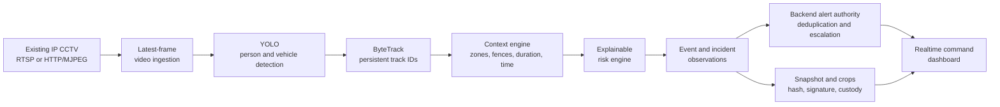
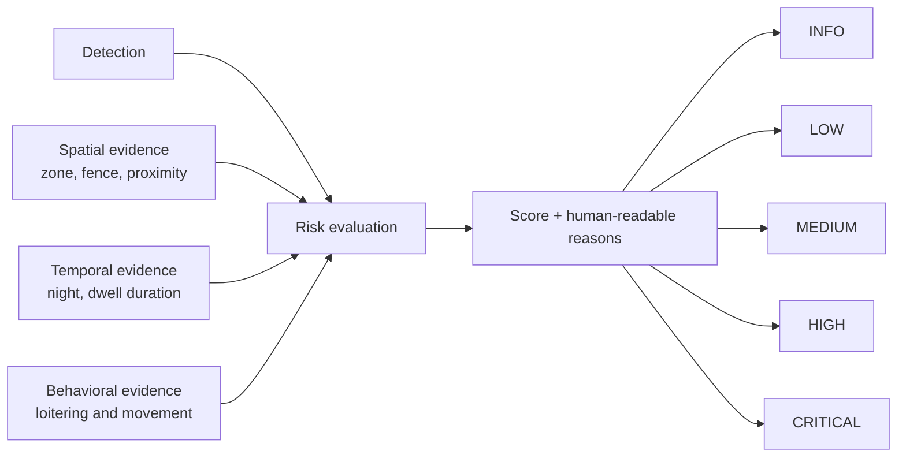
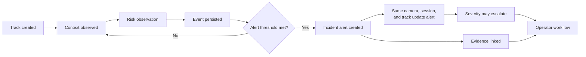
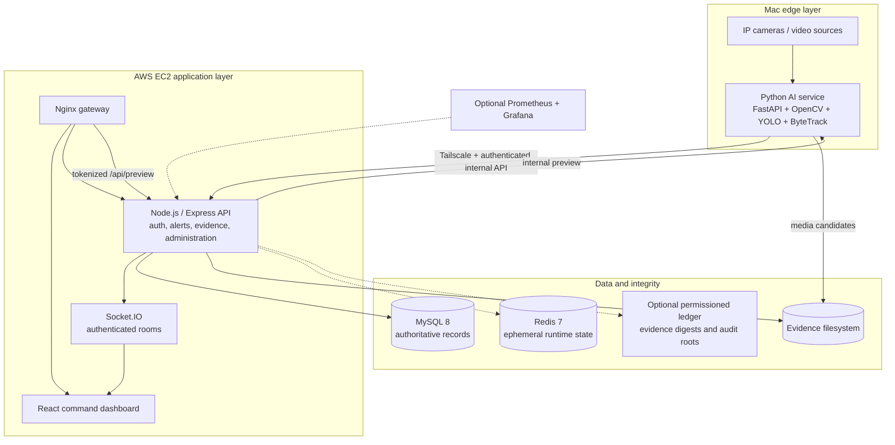

# IBVAP

### Intelligent Border Video Analytics Platform

**Context-aware edge video analytics that turns existing IP CCTV into prioritized, explainable border-surveillance incidents.**


[](http://52.66.247.63)

**Live prototype:** [http://52.66.247.63](http://52.66.247.63)

IBVAP is a Smart India Hackathon 2026 prototype for adding local intelligence to existing CCTV infrastructure. Its hybrid deployment runs the command platform on AWS EC2 and the camera-facing AI runtime on a Mac connected through Tailscale. A detection is treated as an observation—not automatically as a threat.

> **Project status:** functional prototype. Core services, inference workflows, security controls, container deployment, and automated tests are implemented. Field accuracy, throughput, camera compatibility, and operating procedures still require validation on target border hardware and networks.

## At a glance

| Question | Answer |
| --- | --- |
| What problem does it solve? | Continuous monitoring of many passive streams and noisy frame-level alerts. |
| What is different? | Track continuity plus spatial, temporal, and rule context before prioritization. |
| Does it replace cameras? | No. It ingests authorized RTSP and HTTP/MJPEG sources through OpenCV/FFmpeg-compatible capture. |
| Where does inference run? | On the Mac edge runtime; structured observations reach AWS through the private Tailscale network. |
| What reaches the browser? | Authenticated APIs, Socket.IO updates, and a short-lived preview proxy—not raw RTSP URLs or camera credentials. |
| Is it production-deployed? | A public prototype is deployed for evaluation; field qualification is still required. |

## The problem

Traditional CCTV depends on operators watching many concurrent feeds. Frame-level AI can reduce that burden, but “person detected” is not equivalent to “threat detected”: authorized staff, people outside a protected zone, or a vehicle passing normally may all be valid detections.

Border surveillance needs continuity and context: did the same object cross a virtual fence, enter a restricted zone, remain near a boundary, move at night, or loiter long enough to justify attention?

## The solution

IBVAP adds a software intelligence layer over existing cameras:

- local video ingestion, YOLO detection, and ByteTrack multi-object tracking;
- border-specific spatial and temporal rules;
- configurable, explainable risk scoring with human-readable reasons;
- one evolving incident per tracked object instead of repeated frame alerts;
- snapshots and focused crops with integrity and custody metadata;
- role-aware operations through live, alert, map, intelligence, analytics, and administration views.

The backend remains the authority for alerts and persistent state. The AI service produces observations and evidence candidates; it does not write directly to the database.

## Intelligence pipeline



## Why IBVAP is different

| Capability | Traditional CCTV | Basic AI camera | IBVAP prototype |
| --- | --- | --- | --- |
| Human monitoring | Continuous | Reduced by detections | Focused by prioritized incidents |
| Detection | No | Usually frame-based | YOLO observations |
| Track continuity | No | Device-dependent | ByteTrack session/track identity |
| Border context | Operator judgment | Often generic | Zones, virtual fences, proximity, loitering, night movement |
| Risk explanation | Manual | Often opaque | Score, severity, reasons, and rule evidence |
| Alert behavior | Manual | Repeated triggers possible | Incident deduplication and severity evolution |
| Existing-camera support | Native viewing | May require replacement hardware | Software layer over supported IP streams |
| Evidence integrity | External process | Device-dependent | SHA-256, Ed25519, custody chain, optional anchoring |

## Key capabilities

| Area | Implemented capabilities |
| --- | --- |
| **Vision** | YOLO person/vehicle detection, ByteTrack tracking, dedicated plate localization, EasyOCR plate reads, and YuNet face detection |
| **Context** | Restricted-zone entry, virtual-fence crossing, fence proximity, night movement, and loitering duration |
| **Incidents** | Explainable risk, five severities, confirmation, deduplication, escalation, and operator workflows |
| **Evidence** | Best-frame snapshot, optional crops, integrity verification, custody, retention, and incident packages |
| **Operations** | Live surveillance, incidents, intelligence, map, analytics, health, administration, English/Hindi UI, and themes |
| **Security** | JWT validation and revocation, RBAC, TOTP MFA and recovery codes, login lockout, rate limits, security headers, audit logging, and short-lived preview tokens |

Face processing is **detection only**: the repository does not implement facial recognition, identity matching, or biometric embeddings. ANPR results are accepted only after validation and multi-read consensus; a failed or low-confidence read is retained as unconfirmed rather than guessed.

## Context-aware risk engine



Enabled rule weights are normalized against the maximum currently scorable weight and capped at 100. Default severity boundaries are `INFO 0`, `LOW 20`, `MEDIUM 40`, `HIGH 60`, and `CRITICAL 80`. Loitering contributes duration-tier evidence. High-risk observations use temporal confirmation, and a normal `CRITICAL` decision requires at least two independent confirmed signals unless duration evidence alone reaches that tier.

The backend creates alerts by default at `MEDIUM` or above with a risk score of at least 40. Rule configuration is loaded from the application, so operational policy is not hard-coded into the detector.

## Incident lifecycle



The incident key combines camera, stream session, and track identity. Subsequent observations update the existing alert instead of producing one alert per frame. Stream reconnects create a new session so stale track IDs do not bleed into a new incident.

## Architecture



The public prototype hosts Nginx, React, Node.js, MySQL, and Redis on AWS EC2. The Mac AI service remains private behind Tailscale. The browser follows `AWS Nginx → backend /api/preview → Tailscale → Mac AI`; it never receives the RTSP URL, camera credentials, or the Mac's private address.

## Technology stack

| Layer | Technology | Purpose |
| --- | --- | --- |
| Interface | React 18, Vite 5, Tailwind CSS, React Router | Responsive command dashboard |
| Maps and analytics | Leaflet, Recharts | Geographic and operational views |
| Application backend | Node.js 18+, Express, Socket.IO | APIs, alert authority, authorization, realtime delivery |
| AI service | Python, FastAPI, OpenCV, PyTorch, Ultralytics | Stream supervision and inference |
| Tracking and secondary AI | ByteTrack, dedicated plate YOLO, EasyOCR, YuNet | Track continuity, ANPR, face detection |
| Persistence | MySQL 8, filesystem evidence, optional Redis | Durable records/media and transient runtime state |
| Integrity | SHA-256, Ed25519, optional AES-256-GCM, optional local ledger | Verification, signatures, encryption, custody anchoring |
| Cloud and private networking | AWS EC2, Tailscale | Public command platform and private backend-to-edge connectivity |
| Delivery and operations | Docker Compose, Nginx, Prometheus, Grafana | Isolated deployment, gateway, optional observability |

Exact dependency versions are locked in npm lockfiles and [AI requirements](ai_engine/requirements.txt).

## Example: detection to alert

1. YOLO detects a person in a sampled camera frame.
2. ByteTrack associates the detection with a persistent track.
3. The context engine confirms that the track entered a restricted polygon and remained close to a configured fence.
4. Duration and night-time rules add temporal evidence.
5. The risk engine returns a score, severity, and reasons such as `RESTRICTED_ZONE_ENTRY` and `FENCE_PROXIMITY`.
6. The backend persists an event and, when the threshold is met, creates or updates the incident alert.
7. The best evidence frame is linked, hashed, signed, and added to the custody chain.
8. Socket.IO publishes the update to authorized dashboard rooms for operator action.

## API and realtime overview

| Method | Endpoint | Purpose |
| --- | --- | --- |
| `POST` | `/api/auth/login` | Authenticate and begin the MFA flow when enabled |
| `GET` | `/api/cameras` | List cameras visible to the current role |
| `GET` | `/api/cameras/:cameraId/preview-token` | Issue a short-lived authorized preview token |
| `GET` | `/api/events` | Search contextual observations |
| `GET` | `/api/alerts` | Search prioritized incidents |
| `POST` | `/api/alerts/:alertId/acknowledge` | Apply an audited operator action |
| `GET` | `/api/alerts/:alertId/package` | Retrieve the incident evidence package |
| `GET` | `/api/integrity/:evidenceId/integrity` | Read integrity metadata |
| `POST` | `/api/integrity/:evidenceId/verify` | Recompute and verify evidence integrity |
| `GET` | `/api/analytics/overview` | Retrieve dashboard analytics |

Authenticated Socket.IO connections join role-, user-, and camera-scoped rooms. The backend emits event, alert, and camera updates; the client reconnects without bypassing authorization.

## Evidence integrity and security

- **Exact-byte SHA-256 hashes** expose post-capture modification.
- **Ed25519 signatures** bind integrity records to a configured signing key.
- **Append-only custody links** connect `CREATED`, `HASHED`, `SIGNED`, and optional `ANCHORED` actions.
- **Optional AES-256-GCM** protects evidence files at rest when keys are configured.
- **Optional ledger nodes** replicate hash-linked blocks containing evidence digests and Merkle audit roots. This is a local permissioned prototype, not a production consensus network.
- **JWT controls** validate issuer, audience, token version, JTI revocation, and role permissions. MFA, account lockout, Helmet/CSP, CORS, and rate limiting provide additional layers.
- **Internal service authentication** requires `X-IBVAP-AI-Key`; camera secrets stay server-side.

Evidence media remains off-ledger. MySQL is the source of truth for application state, and the filesystem stores the actual JPEG/crop bytes.

## Edge-first operation and reliability

The AI service performs capture and inference near the camera side, sending structured observations and selected evidence upstream. This reduces frame-by-frame application traffic and enables quicker local analysis. It does **not** yet provide a durable disconnected queue: backend connectivity is required to persist new events and alerts.

Implemented resilience mechanisms include latest-frame single-slot decoding, stale-frame rejection, bounded secondary-analysis scheduling, 1–15 second reconnect backoff with jitter, camera worker supervision, session reset after reconnect, observation idempotency, bounded evidence candidates, and at most three accepted ANPR samples per consensus window. Redis and ledger integrations can degrade independently; MySQL remains authoritative.

## Validation snapshot

The current checkout was validated locally on **23 September 2026**. These results verify software behavior, not field accuracy or a hardware capacity guarantee.

| Check | Result |
| --- | --- |
| AI automated tests | **407 passed** |
| Frontend automated tests | **41 passed** |
| Frontend production build | **Passed**; Vite emitted only a bundle-size advisory |
| Controlled person-video run | 90 sampled frames produced 90 person detections consolidated into 1 continuous track |
| Controlled ANPR run | 155 sampled frames produced 341 vehicle frame-detections, 7 tracks, and 294 plate detections; 111 OCR attempts produced no accepted text at unchanged production thresholds |

The ANPR result demonstrates conservative rejection rather than a claimed read-rate. No standardized cross-hardware FPS, API latency, or accuracy benchmark is published yet.

### Run the checks

```bash
# Frontend
cd frontend && npm test && npm run build

# AI engine (with its virtual environment active)
cd ai_engine && python -m pytest -q

# Backend: requires a disposable MySQL test database
cd backend && npm run db:prepare-test && npm test
```

Backend integration tests mutate their configured database. Never point them at operational data. See [backend setup](docs/backend-setup.md) for isolated test configuration.

## Repository structure

```text
IBVAP/
├── ai_engine/       # Ingestion, detection, tracking, context, risk, OCR, evidence
├── backend/         # Express APIs, alert authority, security, persistence, Socket.IO
├── frontend/        # React command dashboard
├── database/        # MySQL setup, migrations, and controlled seeds
├── ledger/          # Optional permissioned integrity-ledger prototype
├── infra/           # Nginx, Prometheus, and Grafana configuration
├── storage/         # Runtime evidence mount
├── docs/            # Architecture, security, deployment, and validation notes
├── scripts/         # Readiness, deployment, health, and backup automation
└── docker-compose.yml
```

## Deployment

### Current hosted prototype

| Location | Running components |
| --- | --- |
| AWS EC2 | Nginx, React frontend, Node.js backend, MySQL 8.4, Redis 7 |
| Mac edge node | FastAPI AI service, YOLO11, ByteTrack, ANPR/EasyOCR, and YuNet face detection |
| Private link | Tailscale carries backend health, configuration, observations, and preview traffic |

### Prerequisites

- Docker Engine with Compose v2;
- authorized RTSP/HTTP camera sources reachable from the deployment host;
- local model assets: `yolo11n.pt`, `license_plate_detector.pt`, `face_detection_yunet_2023mar.onnx`, and EasyOCR model files;
- writable persistent evidence storage.

The deployment never downloads model weights at runtime.

```bash
git clone https://github.com/alive7z/Intelligent-Border-Video-Analytics-Platform.git
cd Intelligent-Border-Video-Analytics-Platform
cp deploy.env.example .env
# Replace every REPLACE_ME value and set absolute model/storage paths where required.
./scripts/deploy/deploy.sh .env
```

The script validates configuration and models, builds images, migrates MySQL, starts services, and checks health. The base stack contains MySQL, backend, AI engine, frontend, and Nginx. Set `COMPOSE_PROFILES=cache,ledger,monitoring` only when configured.

### Important configuration

| Variable | Purpose | Required |
| --- | --- | --- |
| `DB_PASSWORD`, `MYSQL_ROOT_PASSWORD` | Independent MySQL credentials | Yes |
| `JWT_SECRET` | Access-token signing | Yes |
| `AI_SERVICE_TOKEN` | Backend/AI service authentication | Yes |
| `PREVIEW_TOKEN_SECRET` | Short-lived preview token signing | Yes |
| `PUBLIC_ORIGIN` | Browser-visible deployment origin | Yes |
| `AI_MODEL_DIR` | Host directory containing three required model files | Yes |
| `EASYOCR_MODEL_DIR` | Absolute host path to offline EasyOCR models | Yes |
| `EVIDENCE_HOST_PATH` | Persistent evidence bind mount | Yes |
| `COMPOSE_PROFILES` | Optional `cache`, `ledger`, and `monitoring` services | No |
| `EVIDENCE_SIGNING_PRIVATE_KEY` | Stable production evidence signer | Recommended |

For component development, copy each service's `.env.example`. Run migrations with `npm run db:migrate`, Express and Vite with `npm run dev` in their directories, and FastAPI with `python main.py --serve` (optionally `--all-cameras`). See the component READMEs and [backend setup](docs/backend-setup.md).

## Engineering decisions

| Problem | Decision | Benefit |
| --- | --- | --- |
| Per-frame detections create alert storms | Persist session/track identity and evolve one incident | Lower duplication and clearer operator history |
| Detection alone lacks intent | Combine spatial, temporal, and behavioral evidence | Priorities are explainable and policy-driven |
| OCR every frame is expensive and unstable | Use bounded plate samples and consensus validation | Controlled compute and fewer guessed plates |
| Camera credentials must not reach clients | Proxy previews with short-lived backend tokens | Smaller browser trust boundary |
| AI should not own application policy | Make the backend sole alert and persistence authority | Clear service ownership and auditable decisions |
| Evidence may be challenged later | Hash, sign, chain custody, and optionally anchor digests | Independently verifiable provenance |

## Scalability and limitations

Today, a camera manager supervises one worker per enabled camera; services are isolated in Docker, Redis can hold ephemeral runtime state, and the API/AI boundary permits independent deployment. Horizontal inference workers, durable event queues, database replicas, and multi-site orchestration are future scaling steps—not capabilities claimed by this prototype.

Current limitations:

- detection and OCR quality depend on lighting, resolution, angle, occlusion, and model/domain calibration;
- CPU/GPU capacity determines the sustainable camera count and sampling rate;
- ONVIF discovery, facial recognition, multi-camera re-identification, and durable offline synchronization are not implemented;
- operational use requires security review, TLS/key provisioning, privacy policy, retention policy, field benchmarks, and failure drills;
- model weights are intentionally excluded and must be obtained with compatible licenses and documented provenance.

Likely next steps are ONNX/TensorRT acceleration, adaptive sampling, durable store-and-forward delivery, multi-camera association, richer GIS integration, thermal-camera evaluation, and reproducible accuracy/throughput benchmarks.

## SIH 2026 alignment

| Problem-statement need | IBVAP approach |
| --- | --- |
| Reuse existing CCTV | Standards-based IP stream ingestion without requiring smart-camera replacement |
| Real-time analytics | Local detection, tracking, context, and realtime dashboard updates |
| Border-specific intelligence | Restricted zones, virtual fences, proximity, loitering, and night context |
| Reduce false urgency | Detection separated from risk; confirmed evidence drives severity |
| Central command visibility | Unified live, incident, intelligence, map, analytics, and health views |
| Defensible evidence | Selected media, integrity verification, custody records, and optional digest anchoring |
| Practical deployment | Containerized services, offline model loading, health checks, migrations, and backups |

## Engineering highlights

- **Architected** a multi-service pipeline separating compute-heavy vision from application policy and persistence.
- **Implemented** track-aware incident deduplication and severity escalation across camera stream sessions.
- **Designed** an explainable rule engine that normalizes active context weights and returns evidence-backed reasons.
- **Built** a realtime Express/Socket.IO backend with scoped rooms, REST workflows, MySQL repositories, and role enforcement.
- **Integrated** YOLO, ByteTrack, plate localization/EasyOCR consensus, and YuNet under bounded secondary workloads.
- **Secured** evidence with byte-level hashes, signatures, custody links, optional authenticated encryption, and optional anchoring.
- **Containerized** the full application behind Nginx with health checks, non-root services, dropped capabilities, and isolated networks.
- **Tested** AI, frontend, security, alert, evidence, and deployment behavior through automated and controlled-video validation.

## Documentation

- [Architecture](docs/architecture.md)
- [AI engine guide](ai_engine/README.md)
- [Backend setup](docs/backend-setup.md)
- [Security design](docs/backend-security.md)
- [Threat model](docs/threat-model.md)
- [Evidence integrity](docs/blockchain-integrity.md)
- [Deployment runbook](docs/docker-deployment.md)

## Contributing

Preserve service ownership, add migrations for schema changes, update environment examples, and include tests. Never commit secrets, keys, weights, captured media, or builds; use authorized footage and retain model provenance.

## License

This repository currently has no project-level `LICENSE` file. Do not assume open-source reuse rights. Dependencies and model assets have separate terms; review their manifests and the [model provenance notes](ai_engine/models/weights/README.md) before distribution.

---

Built for **Smart India Hackathon 2026** as an engineering prototype for intelligent border video analytics.
